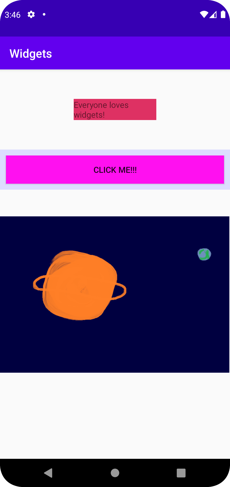

# Report

The app consists of a name and three widgets, in order to pass
the critería for the assignment. The three widgets or views I chose
was a TextView, Button and an ImageView. I started out with code from
the documentation so I could shape it to my liking, and also so I could
further my understanding of how layouts works in Android. I changed
the TextView first, then I created the image for the ImageView in paint,
and finally I changed the title for the Button. There is no
functionality for the Button, but I wanted to include it anyway for
demonstration purposes. Finally I changed the positions of the
widgets, so they wouldn't be the default size. 

This is the complete code for the TextView. I fidgeted around with the dimensions
because I wanted to try to get it in center, although there are probably easier ways to
do that.

```
<TextView
            android:layout_width="wrap_content"
            android:layout_height="wrap_content"
            android:background="@color/cerise"
            android:layout_marginBottom="50dp"
            android:layout_marginTop="50dp"
            android:layout_marginHorizontal="20mm"
            android:text="Everyone loves widgets!" />
```

